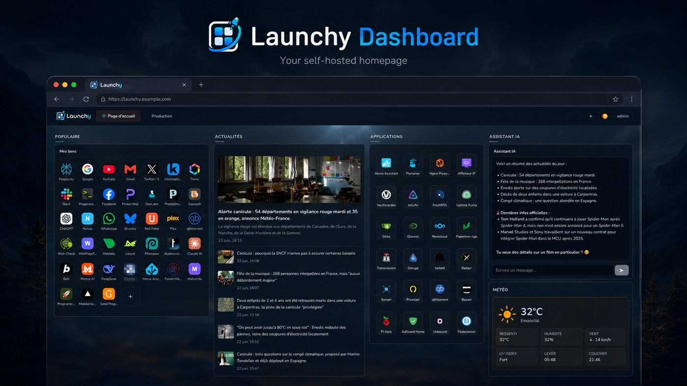
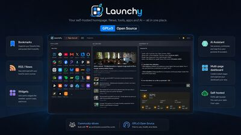
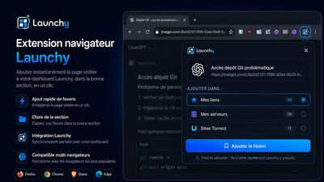

<div align="center">

# Launchy

**Your self-hosted launch page.**

Launchy is a modern, fully self-hosted dashboard that replaces services like start.me or iGoogle.
Deploy it on your own server with Docker, keep full control of your data, and enjoy a polished, premium UI.

  



<p>
  <a href="https://raw.githubusercontent.com/Progerance/launchy/main/docs/images/features-overview.jpg"></a>
  <a href="https://raw.githubusercontent.com/Progerance/launchy/main/docs/images/extension-overview.jpg"></a>
</p>

</div>

## Features

- **Bookmarks** — organized in pages, columns, and widgets with drag & drop reordering
- **Icon picker** — 5 modes: auto favicon, 300+ icon library with search, emoji, upload, custom URL
- **RSS reader** — multi-feed per widget, featured article display, image extraction, configurable layout
- **AI chat** — multi-provider (Mistral, OpenAI, Anthropic), per-widget config, conversation history
- **Weather** — animated SVG icons, hourly + 5-day forecast, detailed info (wind, UV, pressure...)
- **Clock** — timezone support, 12/24h format
- **Search** — Google, DuckDuckGo, Bing, or custom engine
- **Notes** — auto-save notepad widget
- **Embed** — iframe widget for any URL
- **Multi-user** — JWT authentication, user registration, per-user pages
- **Page sharing** — share pages read-only with other users or via public links
- **Themes** — dark/light toggle, custom accent color, background image with opacity
- **Import/Export** — Netscape HTML bookmarks, OPML for RSS feeds
- **Browser extensions** — Firefox (WebExtension) and Chromium (Chrome/Brave/Edge) to add bookmarks from any page
- **Link target** — user preference to open links in new tab or same page
- **Multilingual** — English (default) and French, with community-driven translations welcome
- **Responsive** — works on desktop and tablet

## Quick Start

### Prerequisites

- [Docker](https://docs.docker.com/get-docker/) and [Docker Compose](https://docs.docker.com/compose/install/)

### 1. Clone the repository

```bash
git clone https://github.com/progerance/launchy.git
cd launchy
```

### 2. Configure environment

```bash
cp .env.example .env
```

Edit `.env` and set a secure JWT secret:

```bash
# Generate a random secret
openssl rand -base64 48
```

Paste the generated string as the `JWT_SECRET` value in `.env`.

### 3. Launch

```bash
docker compose up -d
```

Launchy is now running at **http://localhost:3080**.

### 4. First login

The default account is:

| Username | Password |
|----------|----------|
| `admin`  | `admin`  |

> **Change the default password immediately** after first login via the user menu.

The `admin` account starts with a blank dashboard — add your own pages, columns, and widgets from scratch. When you create additional user accounts, they are pre-populated with sample content (bookmarks, RSS feeds, weather, etc.) to help new users get started.

## Configuration

### Environment variables

| Variable     | Default | Description                              |
|-------------|---------|------------------------------------------|
| `JWT_SECRET` | —       | **Required.** Secret key for JWT signing |
| `PORT`       | `3080`  | Host port mapping                        |

### Data persistence

All data (SQLite database) is stored in the `./data/` directory, mounted as a Docker volume. This directory is created automatically on first run.

### AI Chat Widget

The AI chat widget supports three providers. API keys are configured per widget, stored in the database, and never exposed to the browser (all requests are proxied through the server).

| Provider   | Get an API key                                |
|-----------|-----------------------------------------------|
| Mistral    | https://console.mistral.ai/                  |
| OpenAI     | https://platform.openai.com/api-keys         |
| Anthropic  | https://console.anthropic.com/               |

### Weather Widget

Weather data is provided by [wttr.in](https://wttr.in) — no API key required. Configure the city name in the widget settings.

## Reverse Proxy (HTTPS)

To expose Launchy over HTTPS, put it behind a reverse proxy. Examples:

### Nginx

```nginx
server {
    listen 443 ssl;
    server_name launchy.example.com;

    ssl_certificate     /path/to/cert.pem;
    ssl_certificate_key /path/to/key.pem;

    location / {
        proxy_pass http://127.0.0.1:3080;
        proxy_set_header Host $host;
        proxy_set_header X-Real-IP $remote_addr;
        proxy_set_header X-Forwarded-For $proxy_add_x_forwarded_for;
        proxy_set_header X-Forwarded-Proto $scheme;
    }
}
```

### Caddy

```
launchy.example.com {
    reverse_proxy localhost:3080
}
```

### Traefik (Docker labels)

```yaml
services:
  launchy:
    labels:
      - "traefik.enable=true"
      - "traefik.http.routers.launchy.rule=Host(`launchy.example.com`)"
      - "traefik.http.routers.launchy.tls.certresolver=letsencrypt"
      - "traefik.http.services.launchy.loadbalancer.server.port=3000"
```

## Backup & Restore

### Backup

The entire application state is in a single SQLite file:

```bash
cp data/launchy.db data/launchy.db.backup
```

Or with Docker running (safe with WAL mode):

```bash
docker exec launchy sqlite3 /app/data/launchy.db ".backup '/app/data/backup.db'"
```

### Restore

```bash
docker compose down
cp data/backup.db data/launchy.db
docker compose up -d
```

## Browser Extensions

Launchy includes browser extensions for quick bookmark adding from any web page.

### Firefox

1. Build the extension: `./build-extensions.sh`
2. In Launchy, go to **user menu > Browser extension** and click the install link
3. Or navigate directly to `http://your-server:3080/launchy-extension.xpi`

For self-signed extensions, you need to sign them via [Mozilla AMO](https://addons.mozilla.org/developers/) (unlisted channel):

```bash
cd extensions/firefox
web-ext sign --api-key="your-key" --api-secret="your-secret" --channel=unlisted
cp web-ext-artifacts/*.xpi ../../public/launchy-extension.xpi
```

### Chromium (Chrome / Brave / Edge)

1. Build the extension: `./build-extensions.sh`
2. Go to `chrome://extensions` → Enable **Developer mode**
3. Click **Load unpacked** → select the `extensions/chromium/` directory

Or download the .zip from the user menu in Launchy and extract it.

> **Note (Brave users):** Brave Shields may block API calls to local/private IPs. Disable Shields for your Launchy site if you encounter connection issues.

## Development

Run without Docker:

```bash
npm install
node server.js
```

The server starts on `http://localhost:3000` by default (or the port set in the `PORT` environment variable).

## Tech Stack

- **Backend:** Node.js, Express, SQLite (better-sqlite3), JWT (jsonwebtoken + bcryptjs)
- **Frontend:** Vanilla JavaScript SPA (no framework), single `index.html`
- **RSS:** rss-parser with image extraction (enclosure, media:content, media:thumbnail)
- **Icons:** [Simple Icons](https://simpleicons.org/) library + Google Favicons API
- **Font:** [Nunito](https://fonts.google.com/specimen/Nunito) (Google Fonts)
- **Drag & Drop:** [SortableJS](https://sortablejs.github.io/Sortable/) (CDN)
- **Weather:** [wttr.in](https://wttr.in) (no API key)

## Contributing

Contributions are welcome! Here are some ways you can help:

- **Translations** — Launchy currently supports English and French. Adding a new language is as simple as creating a JSON file in `public/lang/` (use `en.json` as a template). Pull requests for new languages are greatly appreciated!
- **Plugins & extensions** — ideas for new widget types, browser extensions for other browsers, or integrations with self-hosted services
- **Bug reports & feature requests** — open an issue on GitHub

## License

This project is licensed under the [GNU General Public License v3.0](LICENSE).

## Author

**Arnaud Dubois** — CEO [PROGERANCE.COM](https://progerance.com)

Contact: support@progerance.com
